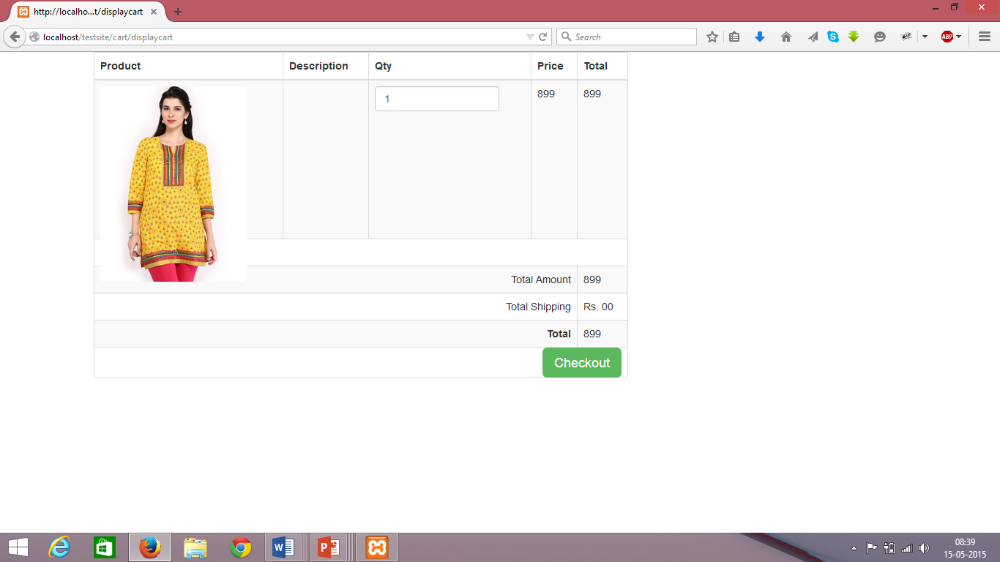

# Ahmedabad_Bazaar
An ecommerce web app allowing users to easily create their own online e-stores 

The aim of is to create a custom PHP application using CodeIgniter as framework for the following definition.
"Create an ecommerce marketplace named as Ahmedabad Bazaar, which is aimed at allowing people to create their own ecommerce stores instantly following a step by step process. all the stores created would be a part of Ahmedabad Bazaar portal in the form of subdomain
It would allow people to create and customize their online store, manage product catalog, use different marketing tools to promote their products and get payments online.

The functionality to get payment online is not implemented

1. Screens
 
Home Page:
•	This is the home page of the website
•	A store admin can login or signup to  create a store here.
•	A customer looking to buy products online can view the stores registered under Ahmedabad bazaar from here.

2. Store Admin Screens

Dashboard screen:
The dashboard is where the store admin can manage his store and edit everything related to his/her store here
 

Some of the tasks that a store admin can perform are:

	Manage the products in his/her store
 

	View details of orders placed in his store
 

3. StoreFront Screens

M Store 
 

E-Store

3. In-Store Screens

	Products Display Page along with a filter sidebar

	Product Description Page

	Shopping Cart screen

 

